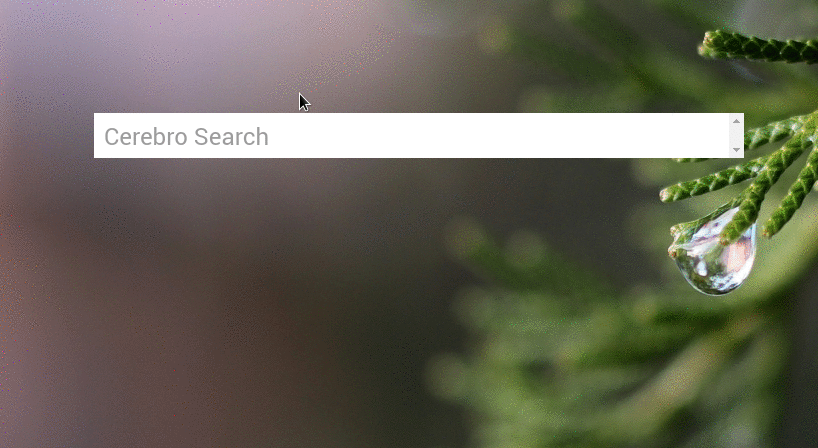

# cerebro-goto-folder-linux

> Cerebro plugin for quickly searching and opening folders on Linux systems, using Tracker as search engine.



## Requirements

* Linux based OS
* [Tracker](https://wiki.gnome.org/Projects/Tracker) running on your system.

## Actions

* Clicking on a result will open the respective folder using the default File Manager (Ex: nautilus)
* Pressing ```ctrl+T``` on a result item will open the respective folder on a Terminal window.


## Related

* [Cerebro](http://github.com/KELiON/cerebro) – Plugin extracted from core Cerebro app;
* [cerebro-plugin](http://github.com/KELiON/cerebro-plugin) – boilerplate to create Cerebro plugins;

## License

MIT © [Bruno Paz](http://brunopaz.net)
